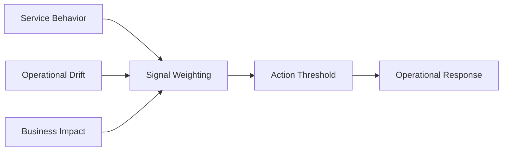

# Predictive Signal Map

## Purpose

This map shows which signals should be watched to anticipate incidents or reliability issues.
It should help teams separate early warning from noise.

## Signal Groups

### Service Behavior

- response time
- error spikes
- saturation

### Operational Drift

- deployment failures
- capacity imbalance
- configuration changes

### Business Impact

- transaction failures
- cost spikes
- user-impact trends

## Figure

## Operating Notes

- signals should be weighted by service criticality
- action should be tied to the most reliable signal combinations
- map should be updated when service behavior changes

## Use

Use this map to decide which combinations of signals are strong enough to predict real operational risk.

## Outcome

A good signal map helps teams reduce noise while keeping the important early warnings visible.

## Use

Use this map to decide which combinations of signals are strong enough to predict real operational risk.
